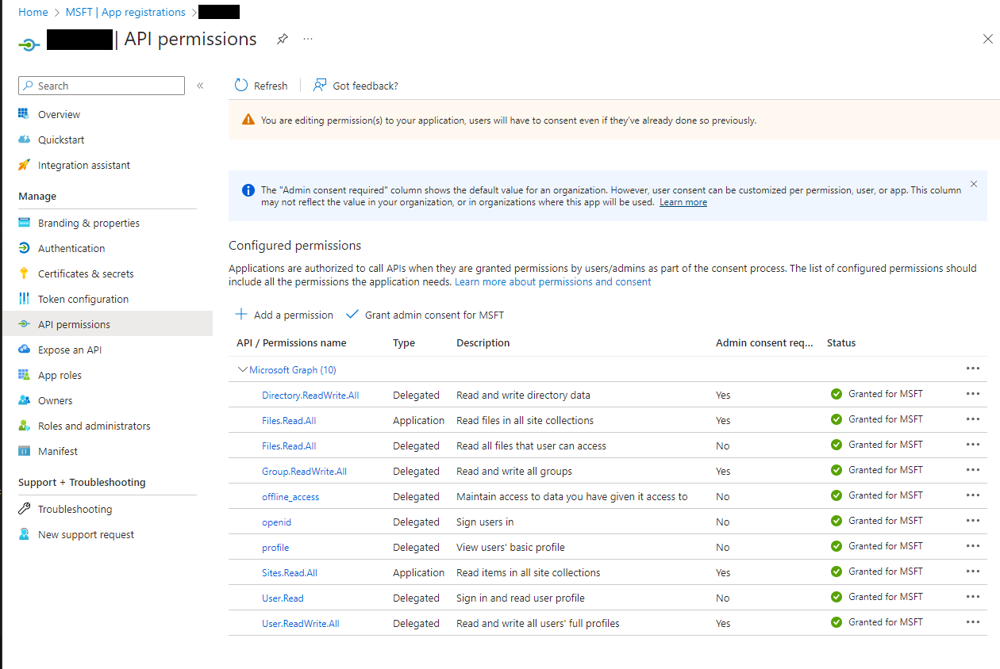
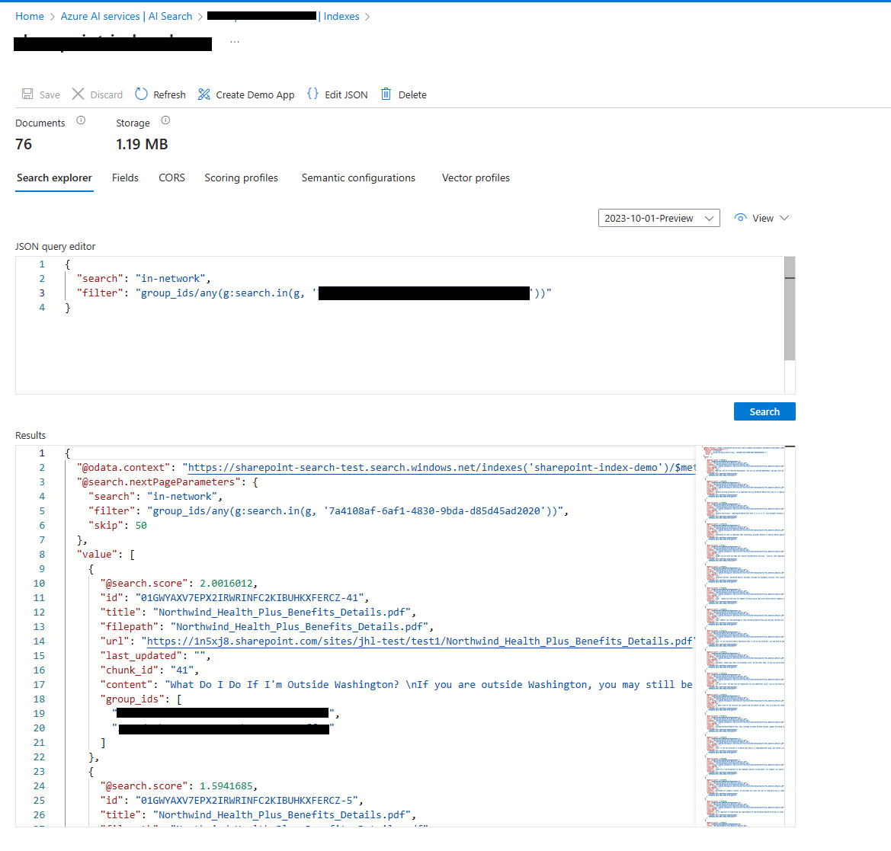

SharePointIndexToAzureAISearch
============

simple console app to demonstrate how to create an Azure AI Search Index using SharePoint files, and its Permission groups.\
this console app will grab sharepoint document library pdf files, and shared group permission,\
and generate an index on Azure AI Search Service with security filter

Preperation
------------

there are some preparation
1. Install dotnet 8.0 runtime\
    https://dotnet.microsoft.com/en-us/download

2. Create / Grant Access to the Entra ID APP\
make sure that **Grant Admin Consent** button next to "add permission" has been processed,\
\
    [](aad-permission.png)

3. Creat Azure AI Search Service\
https://learn.microsoft.com/en-us/azure/search/search-create-service-portal

4. **appsettings.json** must be filled in correctly

    * AadApplicationClientId : `Client Id of Entra ID App`
    * AadApplicationTenantId : `Tenant Id of the Entra Id App`
    * AadApplicationClientSecret: `Client Secret of Entra ID App (found under certification & secrets menu)`
    * SpoSiteUrl : `doamin url of the sharepoint site, ex. https://thisistesting.sharepoint.com/site`
    * SpoSiteName : `name of the sharepoint to index from`
    * AzureAISearchServiceName :  `Azure AI Search Deployment Name`
    * AzureAISearchIndexName : `Azure AI Search Index Name`
    * AzureAISearchAdminKey : `Azure AI Search Key`


Running the App
------------
* to run the app
```
dotnet run
```

* it will list the document library as drives on the console
    * please note that "Documents" refers to root sharepoint files
```
Site ID: thisistesting.sharepoint.com,<SHAREPOINT ID 1>,<SHAREPOINT ID 2>
List of drives:
1. drive-1
2. drive-2
3. Documents
```

* Please select the number that you want to index the file from and press enter
```
Enter the number of the drive you want to select:
2
```

* it will run through the graph calls, and generate group ids which has read access to the document library
    * this console app will only look at AAD groups for permission, any external groups or user will **not** be added.
```
You selected Drive Id: <SHAREPOINT DOCUMENT LIBRARY ID>, Drive Name: <DRIVE NAME>
adding group to index GroupFilter: <READ GROUP 1>
adding group to index GroupFilter: <READ GROUP 2>
```

* start the Azure AI Search Service Initialization
```
Azure Cognitive Search Index: <Azure AI Search Service Name> in https://<Azure AI Search Service Name>.search.windows.net/
```

* if you have not created the index under the search service yet, please type "y"
```
Would you like to create or update index with name sharepoint-index-demo(y/n)? y
Successfully created/updated Azure Cognitive Search Index: <SEARCH INDEX NAME> in https://<SEARCH INDEX NAME>.search.windows.net/
```

* update the index with the pdf files under the sharepoint document library
    * if there is multiple document it will try to grab all pdfs under the document library
```
Would you like to create or update index data (y/n)? y
Successfully uploaded documents to Azure Cognitive Search Index: <SEARCH INDEX NAME>
Successfully uploaded documents to Azure Cognitive Search Index: <SEARCH INDEX NAME>
```

* after index has been created, you can now query the Azure AI Search Index by either
    * calling the Azure AI Search Endpoint via Rest API
    * going to the Azure AI Search in Azure portal, and querying from Web UI
    * [](search-example.png)


&nbsp;

For simplicity the current sample code will only index PDF files\
you can extend this by adding more file reader related code\
\
if sharepoint have lot of permission, you may need to modify the group array graph call to handle pagination\
same goes for sharepoint files, if there is lot of files, you may need to pagninate the api call to handle multiple pages.

&nbsp;
___
please note that this console app referrenced this repo\
https://github.com/subhasishmukhopadhyay2018/democode/tree/main/AzureOpenAI

To take a look at in more detail please refer to the article below\
https://www.linkedin.com/pulse/chat-sharepoint-documents-using-azure-openai-search-mukhopadhyay-txyrc/
